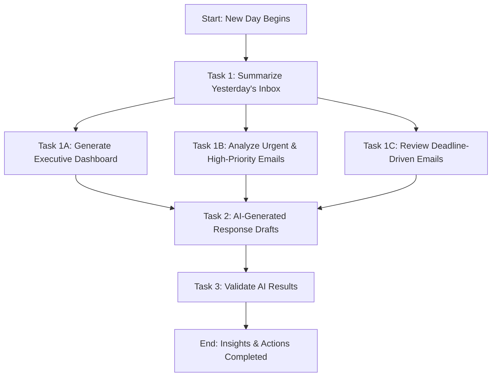

# Description

**Business Context:**
As a business leader at Orion Tech Solutions, you (“Alex Carter”) oversee multiple software development and IT infrastructure projects. Your responsibilities include coordinating with stakeholders, managing escalations, and ensuring timely deliveries. With hundreds of emails flooding your inbox daily, manually sorting through them is time-consuming and increases the risk of missing critical updates, client escalations, or project approvals.

**Objective:**

The goal of this project is to develop a Generative AI-powered system that:

 - ✅ Summarizes emails into actionable insights using the Yesterbox approach (excluding today’s emails).<br>
 - ✅ Prioritizes emails based on urgency, sender, and context.<br> 
 - ✅ Draft context-aware responses to reduce manual effort.<br> 
 - ✅ Evaluate the drafted context-aware responses using LLM-as-a-Judge.<br>

## Tasks & Workflow

### Task 1: Generate a Detailed Summary of Yesterday’s Inbox

#### Task 1A: Executive Dashboard (Top-Level Summary of Yesterday’s Emails)

**Sample Output:**

```
🔹 Total Emails from Yesterday: 100
🔹 🛑 Urgent & High-Priority Emails: 10 (Require Immediate Action Today)
🔹 ⚡ Deadline-Driven Emails: 8 (Must Be Addressed Today)
🔹 📌 Routine Updates & Check-ins: 35 (Review & Acknowledge)
🔹 📎 Non-Urgent & Informational Emails: 45 (Can Be Deferred or Delegated)
🔹 🎉 Personal & Social Emails: 22 (Optional Review)
🔹 🗑️ Spam/Unimportant Emails Filtered Out: 20
```

**AI Conclusion:**

> You have 18 critical emails from yesterday that require action today. Additionally, there are 35 updates to review at your convenience.

#### Task 1B: Analyze Urgent & High-Priority Emails (🛑 Must-Do First Today)

Focus on emails that require immediate action and impact critical projects or client relationships.

#### Task 1C: Review Deadline-Driven Emails (⚡ Needs Attention Today)

Identify emails tied to important deadlines and ensure timely responses.

### Task 2: AI-Generated Response Drafts for Critical Email

For each Urgent & High-priority email or Deadline-Driven email from yesterday, generate an AI-powered response draft for quick review and editing before sending.

**NOTE** : Critical Emailsare the combination of Urgent & High-Priority Emails + Deadline-Driven Emails

### Task 3: Validate AI-Generated Results Using the "LLM as a Judge" Technique

To ensure accuracy and reliability, apply the "LLM as a Judge" technique to evaluate:
- ✅ Relevance: How well does thesummaryaddress the input query or task? 
- ✅ Clarity: How clear and understandable is thesummary? 
- ✅ Actionability: Does thesummaryprovide clear next steps or actionable information?
- ✅ Strengths: Highlight the key strengths of the summary.
- ✅ Improvements: Suggest 1-2 areas for improvement.
- ✅ Overall Justification: Provide a 2-3 line summary evaluation, including key observations.

---
This is the representation of the flowchart of this project:


---

 TIP : Your Task is to write the `system_prompt`& `user_prompt`. In the notebook look for 

<-- YOUR SYSTEM PROMPT GOES HERE --> OR <-- YOUR USER PROMPT GOES HERE -->

## Submission Guidelines

1. Jupyter Notebook / Python Script Converted to HTML file format:
    - Implement all tasks in a structured notebook.
    - Ensure clear function names and inline documentation.
    - Once the project is completed and ready for submission, convert the `ipynb` file to `HTML` file format using these Guidelines.
    - Submit the HTML file formatted notebook before the deadline.
    - Plagiarized submissions will receive zero marks.

## Rubric

### Criteria 1
**Task 1.1 - Top level Summary of Dashboard**

1. AI Identity & Role Definition
   Clearly defines the AI's function as an email assistant.

2. User Goal Clarity
   The AI accurately understands the user's expectations regarding the output.

3. Output Format Readability
   The summary clearly expresses key insights without excessive detail.

**Points: 3**

### Criteria 2
**Task 1.2 - Summary of Urgent & High priority Emails**

1. AI Identity & Role Definition
   Clearly defines the AI's function as an email assistant.

2. User Goal Clarity
   Task: Analyze and Prioritize Urgent & High-Priority Emails.
   These emails should be placed first as they require immediate action.

3. Next Steps Recommendation
   The AI recommends next steps based on the content of the email.

**Points: 3**

### Criteria 3
**Task 1.3 - Summary of Time Sensitive & Deadline Driven Emails**

1. AI Identity & Role Definition
   Clearly defines the AI's function as an email assistant.

2. User Goal Clarity
   Task: Summarization of the Time-Sensitive and Deadline-Driven Emails.

3. Next Steps Recommendation
   The AI recommends next steps based on the content of the email.

**Points: 3**


### Criteria 4
**Task 2 - Draft AI Generated Email response for High Priority Emails**

1. AI Identity & Role Definition
   Clearly defines the AI's function as an Evaluator.

2. User Goal Clarity
   Task: Draft an AI-generated response for a High-Priority email.

3. Contextual Relevance and Response Completeness
   AI-generated drafts effectively capture the core intent of the original email and address all key points, ensuring no important details are omitted.

4. Tonality and Professionalism
   The responses maintain appropriate tone and dynamics, aligning with the sender-recipient relationship (e.g., formal, professional, or polite) to ensure clear and respectful communication.

5. Response Structure
   The response follows a proper email structure:
   - Salutation: <Greetings to the Sender>
   - Body: <Clearly conveys the Next Steps, Decisions, or Required Actions in the body of the email>
   - Closing: <Using a Closing Phrase, e.g., "Thank you">

**Points: 5**

### Criteria 5
**Task 3 - Evaluation LLM-as-Judge**

1. AI Identity & Role Definition
   Clearly defines the AI's function as an Evaluator.

2. User Goal Clarity
   Task: Evaluate the prompts based on relevance, clarity, and actionability scores.

3. Generate Response in the specified Format
   Respond in a specific format containing relevance scores, clarity scores, actionability scores, strengths, improvements, and an overall justification of the AI-generated response.

**Points: 3**


### Criteria 6
**User Recommendations & Suggestions**

1. Observations
   Summarize your observations, including strengths and weaknesses of the use case.

2. Suggestions for Improvement
   Provide recommendations to improve email efficiency or suggest changes that can enhance this use case.

**Points: 2**